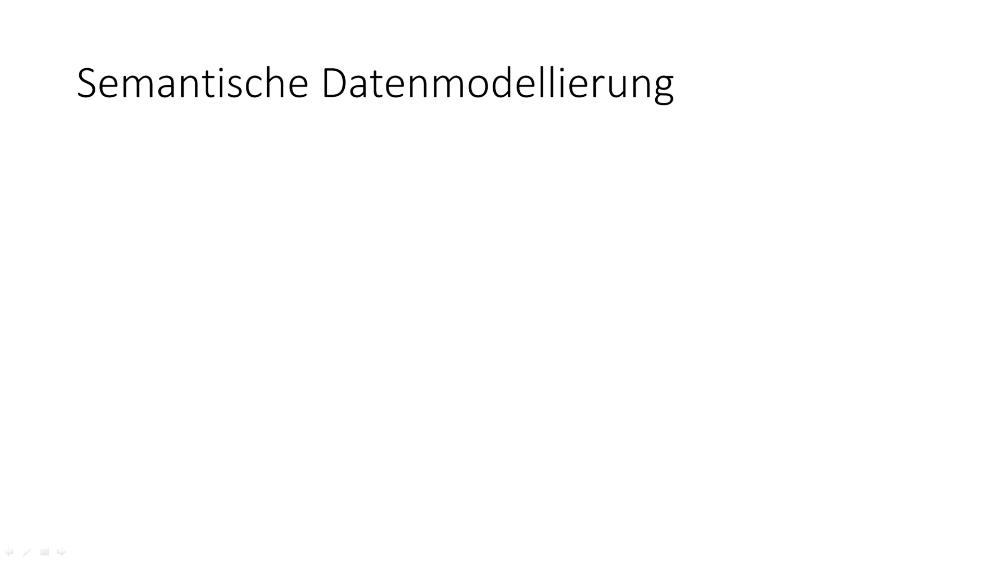

<!--

author:   
email:    
version:  
language: 
narrator: 

icon:     assets\

logo:     https://

comment:  WissKi SODA OERs

-->

# Willkommen

**Hallo SODA**

> To see this document as an interactive LiaScript rendered version, click on the
> following link/badge:
>
> 
>
> 
> This work is licensed under a [Creative Commons Attribution 4.0 International License](http://creativecommons.org/licenses/by/4.0/).

{{1-2}}
******************

******************

{{2-3}}
******************

******************

{{3-4}}
******************

******************

{{4-5}}
******************

******************

{{5-6}}
******************

******************

{{6-7}}
******************

******************

{{7-8}}
******************

******************

{{8-9}}
******************

******************

{{9}}
******************

******************

